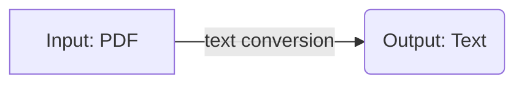

# Text data extractor: PDF to Text

This PDF text data extraction app takes a PDF document as input and return a txt file.

```mermaid
flowchart LR

A[Input: PDF] --> |text conversion| B(Output: Text)


```

